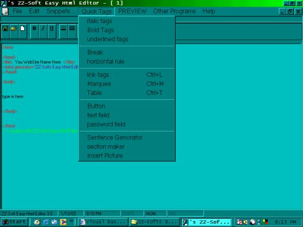



## A amazing html Editor

### Description

This is a Website Making tool , wich is very small and powerful.The design was suposed to be accessable and easy to use.Please dont jusdge it by its looks.There is two ways of making a web page , and script editor.Also , there are hundereds of easy to use , profesional , features.Please atleast tryit , i took the time to put it together. and if you dont like it , you can use it to learn from.please vote i would appreciate it.Im not sure how good a 13 year old programmer is supposed to be.go ahead and judge my program.download it at check it out.the screen shot su cks , but all im asking is , download it and give it some soft of rating.PLEASE. thank you. also: ignore the stu pid regestration thing. it just saves you name and company so it comes up in the about form. thank you and please vote and leave comments!
 
### More Info
 
Visual Basics 6.0

             |
---                |---
**Submitted On**   |2003-01-13 21:23:38
**By**             |[Steven Dorman](https://github.com/Planet-Source-Code/PSCIndex/blob/master/ByAuthor/steven-dorman.md)
**Level**          |Intermediate
**User Rating**    |4.4 (35 globes from 8 users)
**Compatibility**  |VB 6\.0
**Category**       |[Internet/ HTML](https://github.com/Planet-Source-Code/PSCIndex/blob/master/ByCategory/internet-html__1-34.md)
**World**          |[Visual Basic](https://github.com/Planet-Source-Code/PSCIndex/blob/master/ByWorld/visual-basic.md)
**Archive File**   |[Easy\_Html\_1528781132003\.zip](https://github.com/Planet-Source-Code/steven-dorman-a-amazing-html-editor__1-42402/archive/master.zip)

